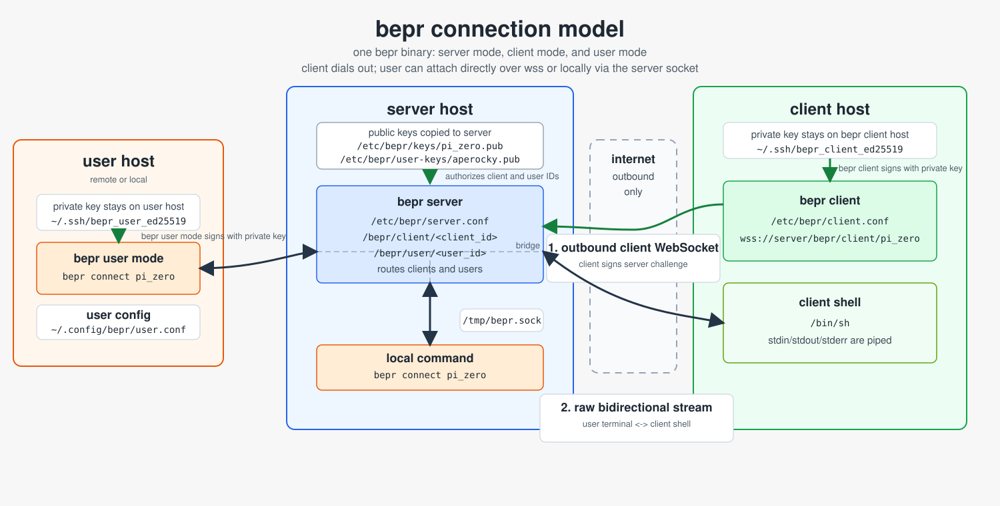

# bepr

`bepr` is a tiny authenticated client/server reverse shell program over outbound WebSocket connections.

A single binary cover all 3 mode: server mode, client mode, and user mode. It is packaged with installation direction for rpm, deb, and pkg, it comes in 1MB.

I created `bepr` because I'm traveling and would like to control computers at home without exposing them to the public internet. This only requires a domain (for TLS), and a server to get working.



## Usage

Go to https://github.com/Aperocky/bepr/releases to find the version of the package for your platform. download it and use these command to install

```sh
sudo installer -pkg bepr-<version>.pkg -target /
sudo dpkg -i bepr_<version>_<arch>.deb
sudo rpm -i bepr-<version>-<arch>.rpm
```

Or use [update scripts](https://github.com/Aperocky/bepr/tree/main/packaging/scripts) to automatically install it by running the script:

```
curl -fsSL https://raw.githubusercontent.com/Aperocky/bepr/main/packaging/scripts/update-deb.sh | sh
curl -fsSL https://raw.githubusercontent.com/Aperocky/bepr/main/packaging/scripts/update-macos.sh | sh
curl -fsSL https://raw.githubusercontent.com/Aperocky/bepr/main/packaging/scripts/update-rpm.sh | sh
```

And now, depending on what your machine is for, configure each host. The binary works in all three modes but does not sync automatically — set up before you leave!

### Server mode

You need your own TLS cert and domain; that part is not covered by `bepr`. Create the server config:

```txt
# cat /etc/bepr/server.conf
bind = 0.0.0.0:443
key_dir = /etc/bepr/client-keys
tls_cert = /etc/bepr/tls/cert.pem
tls_key  = /etc/bepr/tls/privkey.pem
```

Start the service:

linux:
```sh
sudo systemctl enable --now bepr
```

From the server you can list registered clients and connected users, this goes through a local socket.

```sh
root@server.example:~# bepr list
aperocky    user      disconnected
laptop      client    disconnected
mac_m1      client    connected
pi_zero     client    connected
```

You may also connect to a client directly with this local socket, this behave the same as the user mode.

```sh
bepr connect laptop
```

This offers user and client paths on your domain:

```
$domain/bepr/client/mac_m1 # Connect from client
$domain/bepr/user/aperocky # Connect from user
```

Once attached, the `bepr connect` terminal stdin/stdout is piped to the selected client shell. Client shells run inside a PTY, while the server is a raw pass-through byte router. Multiple clients may be connected to the server at the same time, but a single client can only have one user attached at a time.

### Client mode

On each client host, generate a key pair:

```sh
ssh-keygen -t ed25519 -f /etc/bepr/client-keys/pi_zero
```

Copy the public key to the server's `key_dir`:

```txt
/etc/bepr/client-keys/pi_zero.pub  -> client ID pi_zero on server
```

Create the client config. The client ID in the URL must match the public key filename on the server:

```txt
# cat /etc/bepr/client.conf
server = wss://server.example/bepr/client/pi_zero
private_key_path = /etc/bepr/client-keys/pi_zero
shell = /bin/sh
```

Start the service/daemon:

linux:
```sh
sudo systemctl enable --now bepr
```

mac:
```sh
sudo launchctl bootstrap system /Library/LaunchDaemons/com.bepr.plist
sudo launchctl enable system/com.bepr
sudo launchctl kickstart -k system/com.bepr
```

The legacy path `domain/bepr/$name` is also accepted for backwards compatibility with older clients. Start the service the same way as the server.

Note: the client spawns a shell immediately on connecting to the server, not when a user attaches. The shell runs persistently in the background. If you attach and find the terminal in a bad state, run `stty sane`. If the shell itself is unresponsive, kill it by PID on the client machine — the client will automatically reconnect and spawn a fresh shell within 10 seconds.

### User mode

To operate from a remote machine without SSH-forwarding the server socket, use user mode. On the server, add a `user_key_dir` to the server config:

```txt
# cat /etc/bepr/server.conf
bind = 0.0.0.0:443
key_dir = /etc/bepr/client-keys
user_key_dir = /etc/bepr/user-keys
tls_cert = /etc/bepr/tls/cert.pem
tls_key  = /etc/bepr/tls/privkey.pem
```

Copy the user's public key to the server:

```txt
/etc/bepr/user-keys/aperocky.pub  -> user ID aperocky
```

On the user machine, create a user config:

```txt
# cat ~/.config/bepr/user.conf
server = wss://server.example/bepr/user/aperocky
private_key_path = ~/.ssh/aperocky_user_ed25519
```

`bepr list` and `bepr connect` will use this config automatically with no extra flags. Your commands bridge from the server directly into client hosts.

## Run Manually or Test

`bepr` binary can be manually ran without service/packaging with direct commands and arguments:

```sh
./bepr server --config $server_config_path
./bepr client --config $client_config_path
./bepr connect --socket $socket_file_path $destination
```
